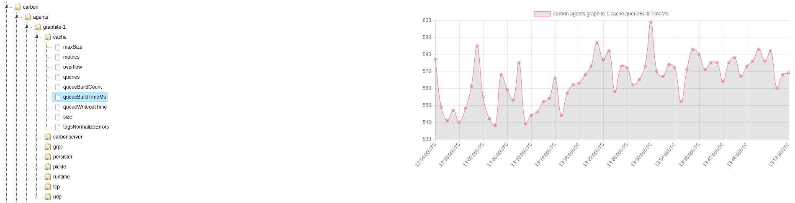

This is a simple graphical explorer for Graphite metrics.

Usefull when you use `https://github.com/go-graphite/carbonapi` api server for instance.

# Requirements

User browser needs access to Graphite API.

# Configuration

Update `app.js` head with your settings.
